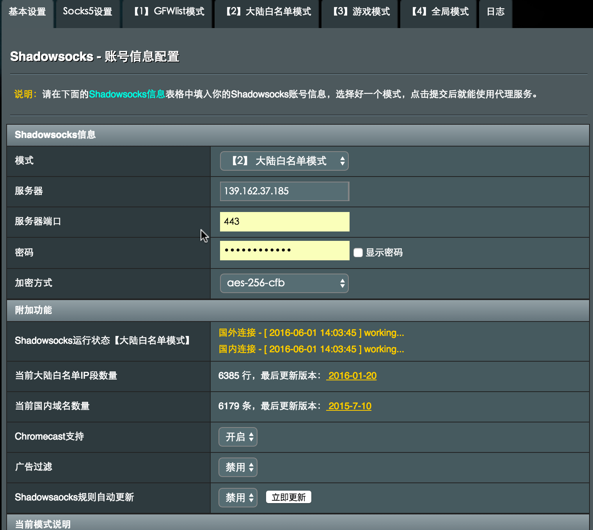

# CoreOS 双网卡 cross the GFW
## 1. 需求描述
　　现有三台物理服务器, 通过 shadowsocks 配合路由器固件实现透明翻墙(服务器无需配置翻墙客户端, 自动判断国内、国外线路是否通过代理访问).


　　由于三台物理服务器出口接入翻墙路由器使用的 NAT 网络模式经过一次地址转换, 同一网络无法访问, 所以使用双网卡策略. 通过添加静态路由策略, 使服务器访问外网走翻墙路由器, 内网服务器网关.

__资源清单列出:__
- 国外 VPS (访问Google、docker、quay.io 高速稳定)
- 可刷 SS 翻墙固件的路由器一台
- 所有服务器拥有有双网卡

## 2. 环境搭建
### 2.1. 搭建 Shadowsocks 服务器
登录购买的境外 VPS 后, 执行以下命令即可快速安装:

```bash
# 这里我们选择 Go 版本的 shadowsocks , 对多客户端并发支持比较好
wget --no-check-certificate https://raw.githubusercontent.com/teddysun/shadowsocks_install/master/shadowsocks-go.sh
chmod +x shadowsocks-go.sh
./shadowsocks-go.sh 2>&1 | tee shadowsocks-go.log

# 根据提示填入必要参数后会安装成功
Congratulations, shadowsocks-go install completed!
Your Server IP:your_server_ip
Your Server Port:your_server_port
Your Password:your_password
Your Local Port:1080
Your Encryption Method:aes-256-cfb

Welcome to visit:https://teddysun.com/392.html
Enjoy it!
```

### 2.2. 安装支持 SS(Shadowsocks 插件)的路由
这里我们使用的是 NetGearR7000 型号的路由, 刷的是 merlin 改版固件, 具体过程如下, 按照步骤谨慎操作, 这里不再阐述.

刷固件方法: [http://post.smzdm.com/p/51938/](http://post.smzdm.com/p/51938/)

根据 VPS 上生成 server_ip 、port、password、加密方式填写, 模式选择大陆白名单模式(所有国外流量自动走代理, 不用维护代理列表). 




### 2.3. 配置网络结构


## 3. 配置系统静态路由
### 3.1. 安装配置 CoreOS 系统
通过 PXE 方式安装, 具体步骤查看[https://github.com/k8sp/bare-metal-coreos/blob/master/README.md](https://github.com/k8sp/bare-metal-coreos/blob/master/README.md)
### 3.2. 配置系统自动加载静态路由
在`/etc/systemd/network`目录下分别创建`10-static.network`和`20-dhcp.network` 两个文件

```bash
# 创建 10-static.network
vim 10-static.network
---
[Match]
Name=eno1

[Network]
Address=10.10.10.192/24

[Route]
Gateway=10.10.10.254
Destination=10.200.0.0/16

[Route]
Gateway=10.10.10.254
Destination=192.169.100.0/24

# 创建 20-dhcp.network
vim 20-dhcp.network
---
[Match]
Name=en*

[Network]
DHCP=yes
```


　

