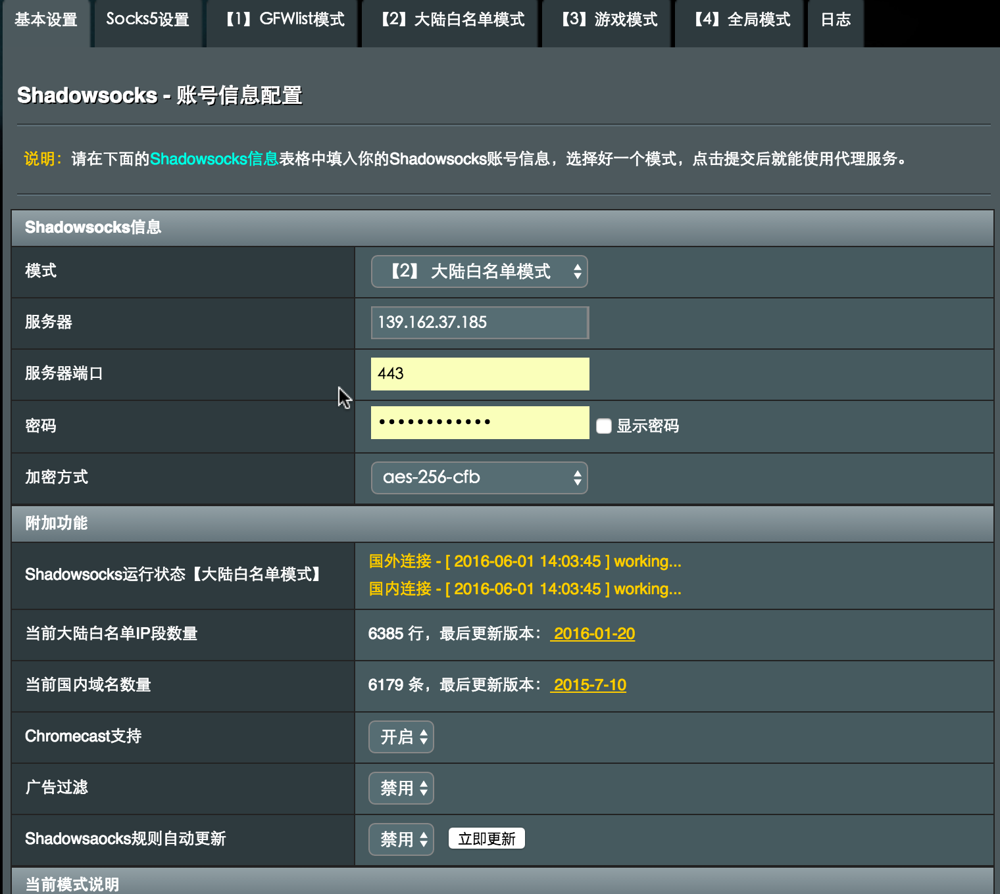

# 配置透明翻墙路由器

## Shadowsocks 简介

**Shadowsocks**（中文名称：**影梭**）是使用[Python](https://zh.wikipedia.org/wiki/Python)等语言开发的、基于[Apache许可证](https://zh.wikipedia.org/wiki/Apache%E8%AE%B8%E5%8F%AF%E8%AF%81)开源的代理软件.

Shadowsocks的运行原理与其他代理工具基本相同，使用特定的中转服务器完成数据传输。

在服务器端部署完成后，用户需要按照指定的密码、加密方式和端口使用客户端软件与其连接。在成功连接到服务器后，客户端会在用户的电脑上构建一个本地socks5代理。浏览网络时，网络流量会被分到本地socks5代理，客户端将其加密之后发送到服务器，服务器以同样的加密方式将流量回传给客户端，以此实现代理上网。

__特点__:

- Shadowsocks使用自行设计的协议进行加密通信。[[4\]](https://zh.wikipedia.org/wiki/Shadowsocks#cite_note-4) 加密算法有[AES](https://zh.wikipedia.org/wiki/%E9%AB%98%E7%BA%A7%E5%8A%A0%E5%AF%86%E6%A0%87%E5%87%86)、[Blowfish](https://zh.wikipedia.org/wiki/Blowfish_(%E5%AF%86%E7%A0%81%E5%AD%A6))、[IDEA](https://zh.wikipedia.org/wiki/IDEA%E7%AE%97%E6%B3%95)、[RC4](https://zh.wikipedia.org/wiki/RC4)等，除创建[TCP](https://zh.wikipedia.org/wiki/TCP)连接外无需[握手](https://zh.wikipedia.org/wiki/%E6%8F%A1%E6%89%8B_(%E6%8A%80%E6%9C%AF))，每次请求只转发一个连接，因此使用起来网速较快，在移动设备上也比较省电。
- 所有的流量都经过算法加密，允许自行选择算法，所以比较安全。
- Shadowsocks通过[异步I/O](https://zh.wikipedia.org/w/index.php?title=%E5%BC%82%E6%AD%A5I/O&action=edit&redlink=1)和事件驱动程序运行，响应速度快。
- 客户端覆盖多个主流操作系统和平台，包括Windows，OS X，Android和iOS系统和路由器（OpenWrt）等[[5\]](https://zh.wikipedia.org/wiki/Shadowsocks#cite_note-5)。
- 专为移动设备和无线网络优化。

## 搭建 Shadowsocks 服务器

首先购买境外 VPS, 可以选择 [bandwagonhost](https://bandwagonhost.com), [linode](https://www.linode.co://www.linode.com), [dititalocean](https://www.digitalocean.com) 等。购买后得到一台虚拟主机和一个 IP，虚拟主机上可以安装主流的 Linux 操作系统.
登录 VPS 后, 执行以下命令安装 Shadowsocks 服务器程序:

```bash
# 这里我们选择 Go 版本的 shadowsocks , 对多客户端并发支持比较好
wget --no-check-certificate https://raw.githubusercontent.com/teddysun/shadowsocks_install/master/shadowsocks-go.sh
chmod +x shadowsocks-go.sh
./shadowsocks-go.sh 2>&1 | tee shadowsocks-go.log

# 根据提示填入必要参数后会安装成功
Congratulations, shadowsocks-go install completed!
Your Server IP:your_server_ip
Your Server Port:your_server_port
Your Password:your_password
Your Local Port:1080
Your Encryption Method:aes-256-cfb

Welcome to visit:https://teddysun.com/392.html
Enjoy it!
```

## 路由器刷集成 Shadowsocks 客户端的固件

我们使用的是 NetGear R7000 型号的路由器, 刷的是 merlin 改版固件, 具体过程如下 (参考自[本文](http://post.smzdm.com/p/51938/)):

(TODO: 将步骤写在这里, 以免引用的网络论坛的贴子失效)

根据 VPS 上生成的 server_ip 、port、password、加密方式填写, 模式选择大陆白名单模式 (所有国外流量自动走代理, 不用维护代理列表).



至此, 路由器翻墙配置完毕.

Enjoy it!