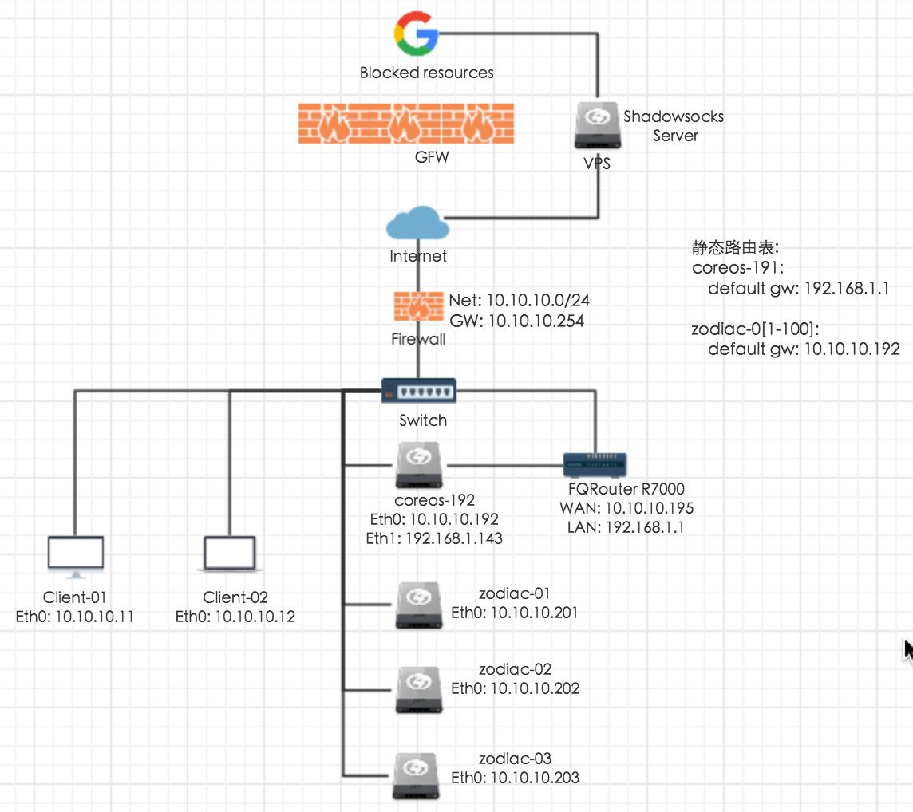

# 内网集群网络构建

## 网络结构图

通过下图来了解网络拓补, 这是一个`10.10.10.0/24` 内网网络,  有服务器, 路由器和客户端, 后面描述每个角色的配置. 	

## 网络配置

__FQRoute R7000__

在 __[透明翻墙路由器配置](../chapter-1/transparent-router-cross-over-the-wall.md)__ 中成功配置翻墙路由, 提供接入在 LAN 口下服务器的透明翻墙的功能

__coreos192配置__

CoreOS192 机器配置双网卡静态路由、通过 NAT(网络地址转换协议) 为其他同网段服务器提供访问外网的服务. 也就是说 CoreOS192 为内网服务器网关, 外网请求会通过 CoreOs192 发送到 FQRouter, 返回时 FQRouter 返回请求到 CoreOS192, CoreOS192 再转写IP地址返回给内网服务器.

- 双网卡配置
  - Eth0: 连接 Switch, 分配 IP 为 10.10.10.192
  - Eth1: 连接 FQRouter 分配 IP 为 192.168.1.143
- 静态路由配置
  - 默认网关(外网出口): 192.168.1.1
  - 10.10.10.0/24 网络请求 Eth0 网卡
- 打开 IPV4 地址转发(net.ipv4.ip_forward) 功能, 提供网桥的服务
- 使用 iptables 实现 NAT 协议

__zadiac-0[1-12]__

服务器为单网卡配置, 只需设置网关为 10.10.10.192 代理上网即可.

__Client-0[1-2]__

客户端和服务端处于同一局域网, 直接通过交换网络方式直接访问服务器, 无需路由.

__结论__

理解了上面每个角色配置, 这样最小化的一个翻墙网络拓补就完成了, 可以满足我们多服务器透明翻墙的需求