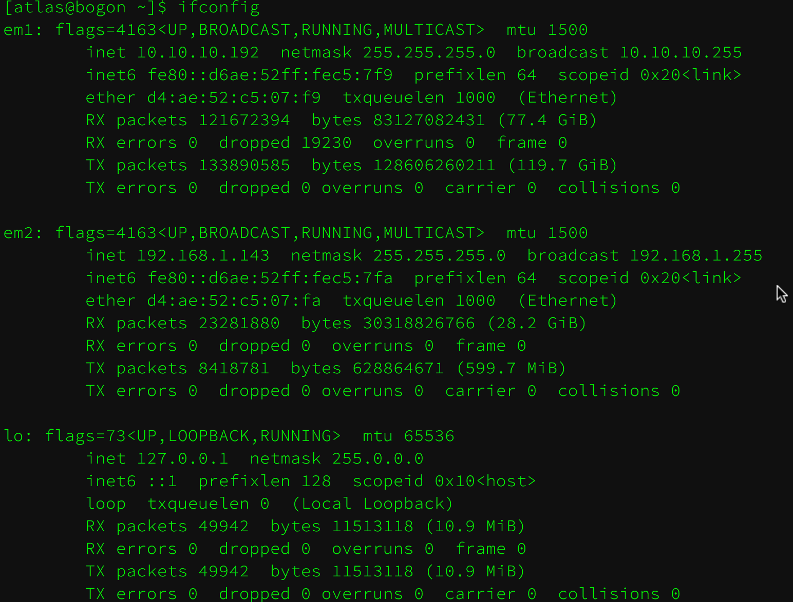
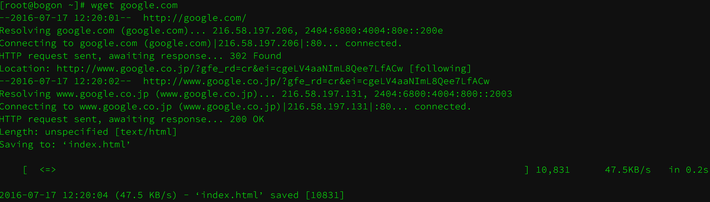
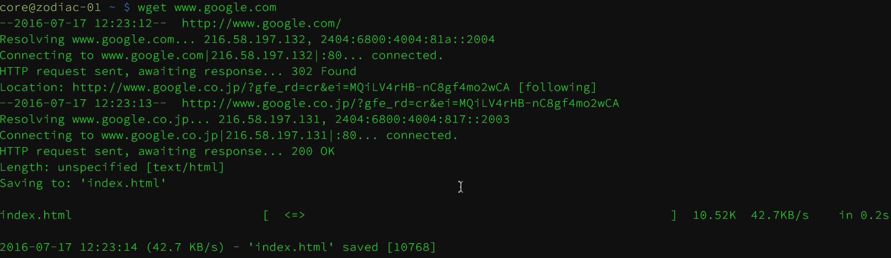

## 配置服务器路由策略

在上一章__[内网集群网络构建](../chapter-2/construction-cluster-network.md)__中介绍了各个角色在翻墙网络中的功能, 下面我们来配置这些角色以正常工作

### 配置 coreos191(路由, NAT协议)

#### 静态路由配置

当前网卡配置, 双网卡的配置信息如下, `10.10.10.192(内网机群网络)`, `192.168.1.143(翻墙网络)`



修改静态路由, 默认外网流量走翻墙网关 192.168.1.1, 机群内部流量走 10.10.10.254, 添加到 `local.rc`, 配置开机启动

```
vim /etc/rc.local
---------
# em1 删除默认路由, 因为同一局域网流量不走网关路由, 所以只要删除 10.10.10.254 即可
route delete default gw 10.10.10.254
```

#### NAT 转发配置

打开 linux 的` ip_forward`(流量转发功能)

```shell
# 编辑 sysctl.conf 添加下面内容
vim /etc/sysctl.conf
-------
net.ipv4.ip_forward = 1
```

配置 iptables 的 NAT 转发功能

```shell
# 同样追加到 /etc/rc.lcoal 中, 注意其中 em2 为翻墙网络的网卡名
iptables -t nat -A POSTROUTING -o em2 -j MASQUERADE
```

#### 验证翻墙

```shell
wget 'www.google.com'
```



## 配置 zodiac-0[1-12]

这些服务为需要翻墙的服务器, 我们只要修改它的默认网关为 `10.10.10.192` 即可, 可以通过静态配置或DHCP来修改网关地址

```shell
# 在 coreos 中如下所示配置
cat /etc/systemd/network/10-static.network
------
[Match]
Name=enp1s0f0

[Network]
Address=10.10.10.201/24
Gateway=10.10.10.192
```

#### 验证翻墙 

#### 结论

至此整个集群翻墙网络已经构建完毕, 客户端无需任何配置.

优点是集群只需一台双网卡机器做翻墙转发, 局域网内其他翻墙服务器(如zodiac-0[1-n])可以批量增加, 无需硬件改造.