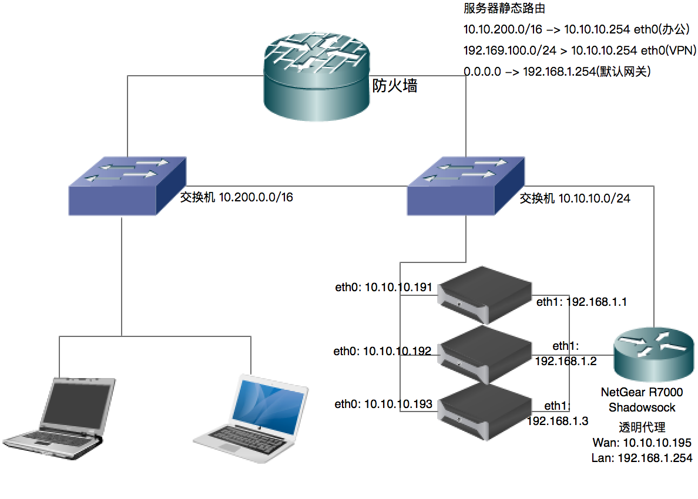

## 配置服务器路由策略

### 网络结构

我们在 3 台安装了 CoreOS 系统的服务器上实现了透明翻墙，网络结构如下图所示：



### 配置系统静态路由

由于三台服务器出口接入翻墙路由器使用的 NAT 网络模式经过一次地址转换, 同一网络无法访问, 所以使用双网卡策略. 通过添加静态路由策略, 使服务器访问外网走翻墙路由器, 内网服务器网关.

### 配置系统自动加载静态路由

在每台服务器的 `/etc/systemd/network` 目录下分别创建 `10-static.network` 和 `20-dhcp.network` 两个文件

```bash
# 创建 10-static.network
vim 10-static.network
---
[Match]
Name=eno1

[Network]
Address=10.10.10.192/24

[Route]
Gateway=10.10.10.254
Destination=10.200.0.0/16

[Route]
Gateway=10.10.10.254
Destination=192.169.100.0/24

# 创建 20-dhcp.network
vim 20-dhcp.network
---
[Match]
Name=en*

[Network]
DHCP=yes
```

